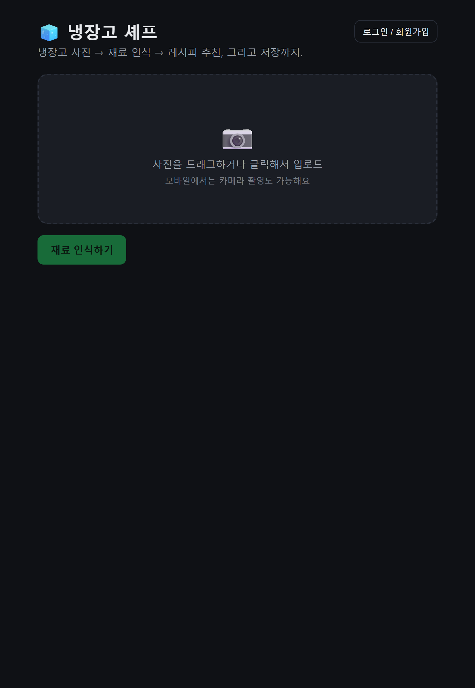
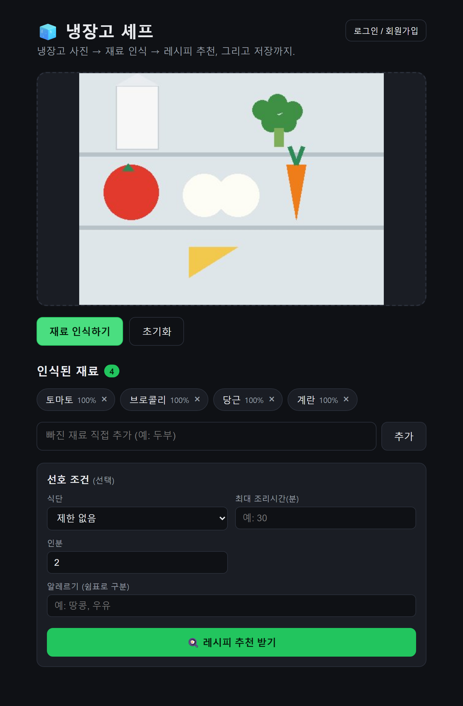
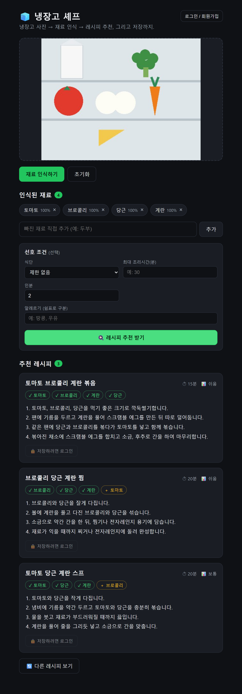
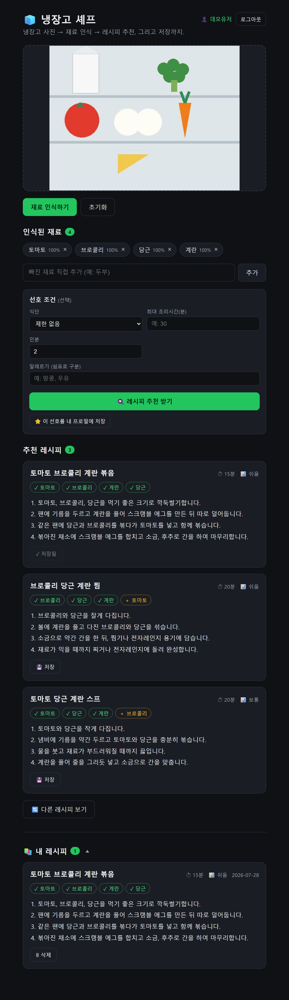

# 🧊 냉장고 셰프 — 재료 인식 & 레시피 추천


냉장고 사진에서 식재료를 인식하고, 그 재료로 만들 수 있는 레시피를 추천하고, 사용자 프로필에 저장하는 웹 앱. OpenRouter의 `google/gemma-4-26b-a4b-it:free` 멀티모달 모델을 사용한다.

- 요구사항 문서: [PRD_step1.md](PRD_step1.md) · [PRD_step2.md](PRD_step2.md) · [PRD_step3.md](PRD_step3.md)

## 진행 상황
- ✅ **1단계** — 이미지 입력 & 재료 인식 (구현 완료)
- ✅ **2단계** — 레시피 생성 (구현 완료)
- ✅ **3단계** — 사용자 프로필 & 레시피 저장 (구현 완료)

## 스크린샷

| ① 초기 화면 | ② 재료 인식 |
|:-:|:-:|
|  |  |
| 사진 업로드 드롭존 | 업로드한 냉장고 사진에서 재료를 인식해 칩으로 표시 |

| ③ 레시피 추천 | ④ 로그인 & 저장 |
|:-:|:-:|
|  |  |
| 보유(✓)/부족(＋) 재료 구분, 조리시간·난이도 | 회원가입 후 레시피 저장 → "내 레시피" 목록 |

> 스크린샷은 실제 앱을 브라우저로 구동해 캡처한 것이다. LLM 특성상 인식·레시피 결과는 실행마다 달라질 수 있다.

## 기술 스택
- **백엔드**: FastAPI (Python), OpenRouter API 호출은 표준 라이브러리 `urllib` 사용
- **프론트엔드**: React + Vite (`/api` → 백엔드 프록시)
- **저장소**: SQLite (`backend/app.db`) — 사용자·세션·레시피
- **인증**: 이메일/비밀번호 (PBKDF2 해시) + Bearer 토큰 세션. 추가 의존성 없이 표준 라이브러리만 사용

## 프로젝트 구조
```
study_04/
├─ backend/
│  ├─ main.py            FastAPI 앱 (인식/레시피/인증/프로필/저장 엔드포인트)
│  ├─ db.py              SQLite 스키마 · 비밀번호 해시 · 세션/레시피 CRUD
│  ├─ requirements.txt
│  └─ test_*.py          통합 테스트
├─ frontend/
│  ├─ src/App.jsx        메인 UI (업로드→인식→레시피→저장 흐름)
│  ├─ src/api.js         토큰 자동 첨부 fetch 헬퍼
│  ├─ src/AuthBar.jsx    로그인/회원가입
│  ├─ src/SavedRecipes.jsx  저장 레시피 목록·삭제
│  └─ vite.config.js     /api 프록시 설정
├─ screenshots/          자동 캡처된 화면
├─ .env / .env.example   OpenRouter 키 (실 키는 커밋 금지)
└─ PRD_step1~3.md        단계별 요구사항
```

## 사전 준비
프로젝트 루트에 `.env` 파일과 OpenRouter 키가 필요하다 (`.env.example` 참고):
```
openrouter_api_key=sk-or-v1-...
```

## 실행 방법

### 1) 백엔드 (FastAPI, 포트 8000)
```bash
cd backend
pip install -r requirements.txt      # 최초 1회
python -m uvicorn main:app --reload --port 8000
```
- `GET  /api/health`   — 상태 및 키 로드 여부 확인
- `POST /api/recognize` — `{ "image": "data:image/...;base64,..." }` → `{ "ingredients": [...] }`
- `POST /api/recipes`   — `{ "ingredients": [...], "preferences": {...}, "count": 3 }` → `{ "recipes": [...] }`
- 인증: `POST /api/auth/signup`, `POST /api/auth/login`, `POST /api/auth/logout`
- 프로필: `GET /api/profile`, `PUT /api/profile` (인증 필요)
- 저장: `POST /api/recipes/save`, `GET /api/recipes/saved`, `DELETE /api/recipes/saved/{id}` (인증 필요)

인증은 `Authorization: Bearer <token>` 헤더 사용. 사용자·레시피는 `backend/app.db`(SQLite)에 저장된다.

### 2) 프론트엔드 (React + Vite, 포트 5173)
```bash
cd frontend
npm install        # 최초 1회
npm run dev
```
브라우저에서 http://localhost:5173 접속. `/api` 요청은 Vite 프록시를 통해 백엔드(8000)로 전달된다.

## 테스트
- `test_api.py` — OpenRouter API 텍스트/이미지 인식 기본 동작 확인
- `backend/test_recognize.py` — 백엔드가 켜진 상태에서 `/api/recognize` 통합 테스트
- `backend/test_recipes.py` — 백엔드가 켜진 상태에서 `/api/recipes` 통합 테스트
- `backend/test_auth.py` — 회원가입→프로필→저장/조회/삭제 + 권한 격리 통합 테스트

> Windows 콘솔에서 한글이 깨지면 `PYTHONUTF8=1` 을 붙여 실행한다.
